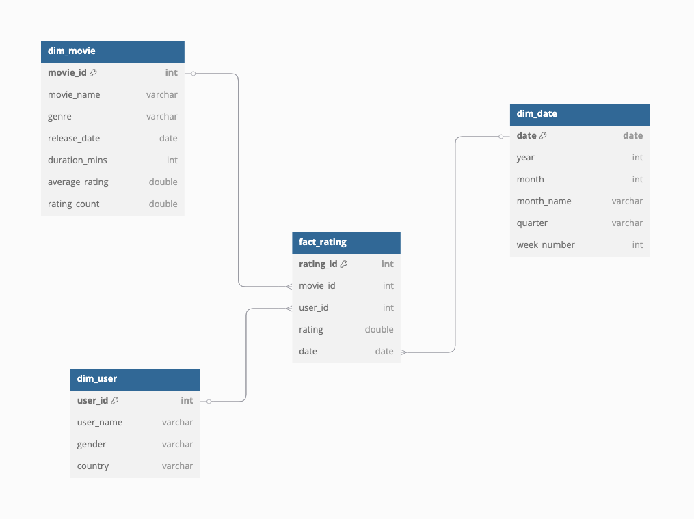

# 🎬 BI Project: Movie Ratings Analytics

This project showcases a complete **Business Intelligence pipeline** using a movie ratings dataset — including data modeling, SQL analytics, and BI-focused insights.

## 📦 Dataset Used

- `dim_movie.csv`
- `dim_user.csv`
- `dim_date.csv`
- `fact_rating.csv`

These datasets were cleaned using Excel and Python and then imported into MySQL using the CSV Import Wizard.

## 🗃️ Dimensional Model (Star Schema)

The data model follows a **star schema** design:

- `fact_rating`: Central fact table storing movie ratings
- `dim_movie`: Contains movie details like name, genre, release date
- `dim_user`: Contains user attributes like gender and country
- `dim_date`: Contains time-based attributes for date-based analysis

[][https://dbdiagram.io/d/movie_data_modeling-6870ec71f413ba35086b285d]

## 🧼 Data Cleaning

Performed using both **Excel** and **Python (pandas)**.

🔹 Excel:
- Preliminary cleanup
- Removing empty columns, fixing formats

🔹 Python:
- Parsed nested JSON-style genre values
- Created flattened structure for genre and dates
- Exported cleaned CSVs for import

📁 Notebook: [`data_cleaning.ipynb`](data_cleaning.ipynb)  

## 🧠 Business Questions Answered

- Top-rated movies
- Most active users
- Ratings by month and genre
- Country-based viewing trends
- Genre performance over time
- User-specific preferences
- Window function examples

Check files:
- `beginner_bi_queries.sql` (easy BI queries ✅)
- `bi_analytics_questions.sql` (10 real-world BI-style questions)
- `example_queries.sql` (JOIN practice)

## 🛠️ Tools Used

- **MySQL Workbench** — for schema design, data import, and queries
- **Excel** — for quick data exploration and genre column cleaning
- **Python (pandas)** — for advanced data cleaning and transformation
- **dbdiagram.io** — to visually design the ERD

> All data was loaded via MySQL Workbench's CSV Import Wizard for realism and speed.

---
